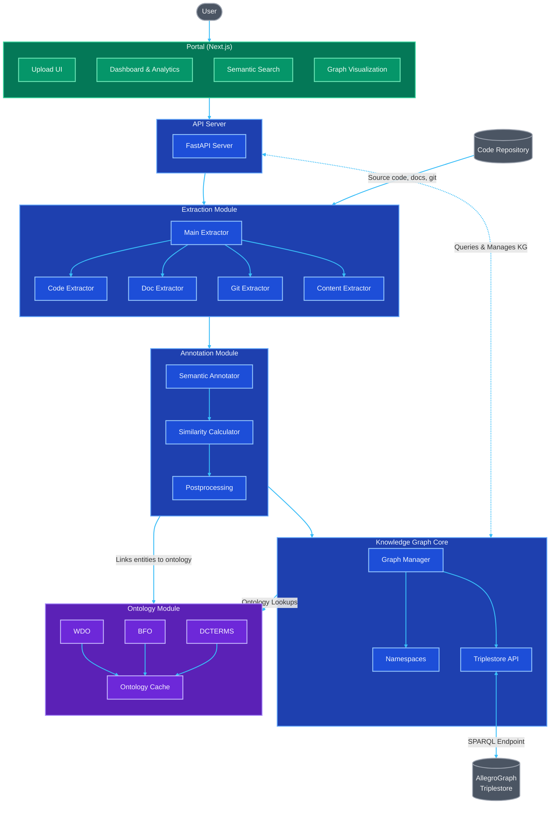

# Semantic Web KMS

[](https://www.python.org/)
[](https://nodejs.org/)

[](https://github.com/shama-llama/semantic-web-kms/actions/workflows/build.yml)
[](LICENSE)

**Semantic Web KMS** is a modular platform for extracting, semantically annotating, and managing software knowledge. It uses the [Web Development Ontology (WDO)](https://web-development-ontology.netlify.app/), supports multi-language code and documentation extraction, and provides a Next portal for search, analytics, and knowledge graph visualization.

## Features

- Ontology-driven semantic annotation
- Multi-language code and documentation extraction
- Knowledge graph and SPARQL querying (AllegroGraph)
- Interactive portal: dashboard, search, graph visualization
- Extensible pipeline and modular architecture

## Architecture


**Semantic Web KMS** is organized into modular components, each responsible for a distinct part of the knowledge management pipeline:

- **Extraction**: Extracts code, documentation, and metadata from repositories.
- **Annotation**: Semantically annotates extracted artifacts using ontologies.
- **Knowledge Graph**: Manages and queries semantic data (RDF, SPARQL, AllegroGraph).
- **Portal**: Provides a Next.js-based web interface for search, analytics, and visualization.



## Setting Up

### Prerequisites

- **Python 3.12**
- **Node.js 18+** and pnpm
- **Git**
- **Python Virtual Environment** (make sure it is 3.12)

### Backend Setup

1. **Clone the repository**

   ```bash
   git clone https://github.com/shama-llama/semantic-web-kms.git
   cd semantic-web-kms
   ```

2. **Set up Python virtual environment**

   ```bash
   # Create and activate virtual environment
   python -m venv .venv
   source .venv/bin/activate  # On Windows: .venv\Scripts\activate
   ```

3. **Install Python dependencies**

   ```bash
   pip install -r requirements.txt
   ```

4. **Install development dependencies (optional)**

   ```bash
   pip install -r requirements-dev.txt
   ```

5. **Set up environment variables**

   Create a `.env` file in the project root with the following variables:

   ```bash
   # AllegroGraph configuration
   AGRAPH_SERVER_URL=https://xyz.allegrograph.cloud
   AGRAPH_CLOUD_URL=https://xyz.allegrograph.cloud/repositories/semantic-web-kms
   AGRAPH_USER=admin
   AGRAPH_PASSWORD=password # the server password, NOT your ag account password
   AGRAPH_REPOSITORY=semantic-web-kms
   AGRAPH_USE_SSL=true
   
   # Google Gemini API Key (for semantic annotation)
   GOOGLE_API_KEY=api_key
   ```

### Frontend Setup

1. **Navigate to the portal directory**

   ```bash
   cd portal
   ```

2. **Install Node.js dependencies**

   ```bash
   pnpm install
   ```

3. **Set up frontend environment variables**

   Create a `.env.local` file in the `portal` directory with:

   ```bash
   NEXT_PUBLIC_API_URL=http://localhost:8000/api
   ```

### Running the Application

1. **Start the backend server** (from project root)

   ```bash
   flask run
   # or for production:
   # gunicorn --bind 0.0.0.0:5000 wsgi:app
   ```

2. **Start the frontend development server** (from portal directory)

   ```bash
   pnpm dev
   ```

3. **Access the application**

   - Frontend: [http://localhost:3000]
   - API: [http://localhost:8000]

### Development Tools

- **Linting & Formatting**

  ```bash
  # Python
  black .
  isort .
  flake8
  
  # JavaScript/TypeScript (from portal directory)
  pnpm lint
  ```

- **Testing**

  ```bash
  # Python tests
  pytest
  
  # Frontend tests (from portal directory)
  pnpm test
  ```

## License

This project is licensed under the terms of the [MIT License](LICENSE)
