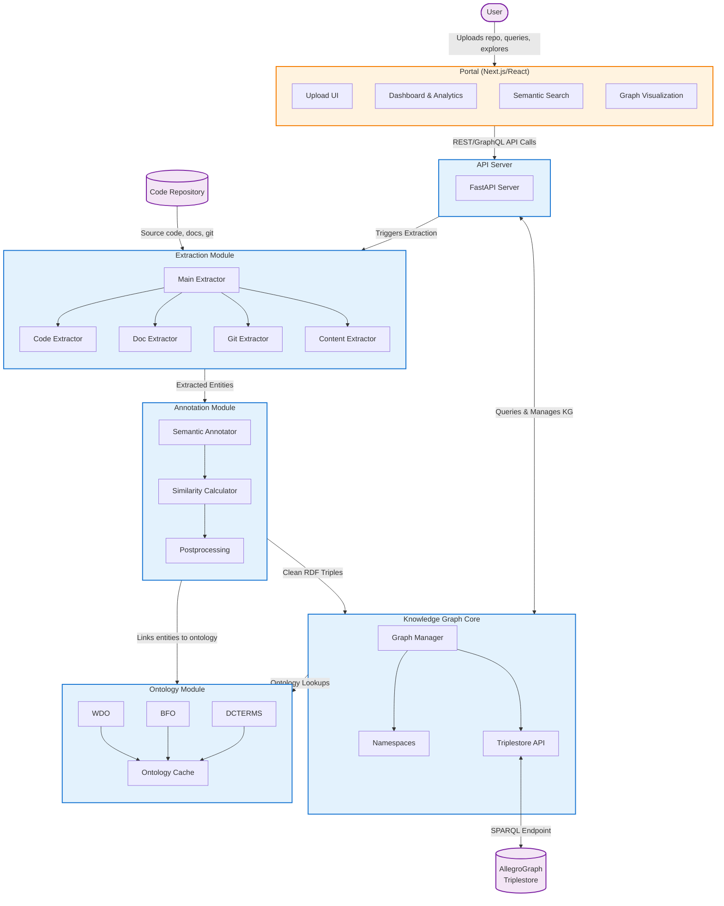

# Semantic Web KMS

**Semantic Web KMS** is a modular platform for extracting, semantically annotating, and managing software knowledge. It uses the [Web Development Ontology (WDO)](https://web-development-ontology.netlify.app/), supports multi-language code and documentation extraction, and provides a Next portal for search, analytics, and knowledge graph visualization.

## Features

- Ontology-driven semantic annotation
- Multi-language code and documentation extraction
- Knowledge graph and SPARQL querying (AllegroGraph)
- Interactive portal: dashboard, search, graph visualization
- Extensible pipeline and modular architecture

## Architecture

**Semantic Web KMS** is organized into modular components, each responsible for a distinct part of the knowledge management pipeline:

- **Extraction**: Extracts code, documentation, and metadata from repositories.
- **Annotation**: Semantically annotates extracted artifacts using ontologies.
- **Knowledge Graph**: Manages and queries semantic data (RDF, SPARQL, AllegroGraph).
- **Portal**: Provides a Next.js-based web interface for search, analytics, and visualization.

## License

This project is licensed under the terms of the [MIT License](LICENSE)
