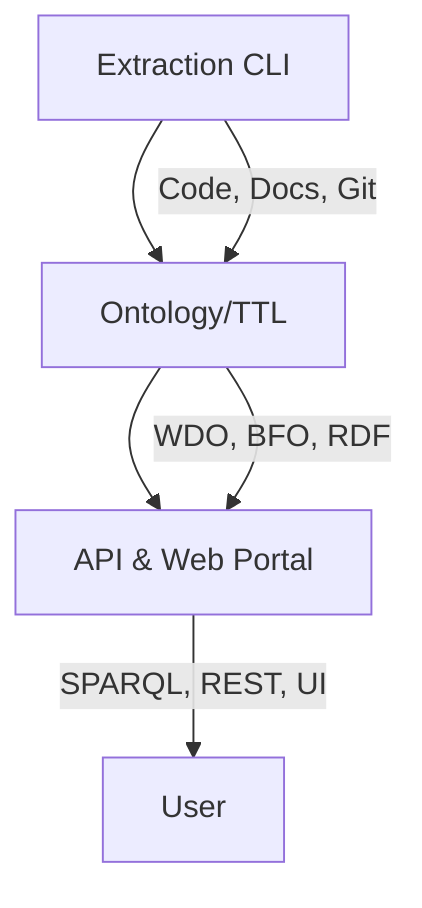

# Semantic Web Knowledge Management System


**Semantic-Web-KMS** is a knowledge management platform to extract, semantically annotate, and organize explicit knowledge from web development projects. It uses the Web Development Ontology (WDO) to represent code, documentation, repository metadata, and digital assets, for search, analytics, and knowledge graph visualization through a web portal.

## Tech Stack


## Features

| Feature                        | Description                                                                                 |
|--------------------------------|---------------------------------------------------------------------------------------------|
| **Ontology-driven**            | Uses WDO (aligned with BFO) to structure extracted knowledge                                 |
| **Multi-source extraction**    | Processes code, documentation, git history, etc.                                         |
| **Semantic annotation**        | Annotates and links entities for rich querying                                               |
| **Web portal**                 | Dashboards, search, and graph visualization                                                  |
| **SPARQL API**                 | RESTful API for querying the knowledge graph                                                 |
| **Automated Extraction**       | Extracts code structure, parses docs, analyzes git history                                   |
| **Modern UI**                  | Dashboard, semantic search, knowledge graph, repository management                           |

## Architecture



- **Backend Extraction Pipeline:**
  - `app/extraction/` modules: file, code, doc, and git extractors
  - Orchestrated by `app/knowledge_pipeline.py` and `app/extraction/main_extractor.py`
- **Ontology:**
  - `model/web_development_ontology.owl` (WDO)
  - `model/basic_formal_ontology.owl` (BFO)
- **API Server:**
  - Flask app in `app/api/server.py` exposes `/api/sparql` and `/api/dashboard_stats`
- **Frontend Portal:**
  - Static files in `portal/` (HTML, CSS, JS)
  - Connects to backend API at `http://localhost:5000`

## Quick Start

| Step | Command/Action                                                                                 |
|------|-----------------------------------------------------------------------------------------------|
| 1    | `git clone <your-repo-url> && cd semantic-web-kms`                                            |
| 2    | `python3 -m venv .venv && source .venv/bin/activate && pip install -r requirements.txt`        |
| 3    | Configure `.env` or export environment variables (see below)                                   |
| 4    | Place repositories in `~/downloads/repos/Thinkster/` or edit `DEFAULT_INPUT_DIR`               |
| 5    | `python -m app.knowledge_pipeline` (extract, annotate, upload)                                 |
| 6    | `python -m app.api.server` (run API server at http://localhost:5000)                           |
| 7    | Open `portal/index.html` in your browser                                                       |

## Installation

### Prerequisites
- Python 3.8-3.12
- [AllegroGraph](https://franz.com/agraph/allegrograph/) triplestore (or compatible SPARQL endpoint)
- Node.js (optional, for advanced frontend development)

### Environment Variables
Create a `.env` file or export the following:

```bash
AGRAPH_SERVER_URL=<http://localhost:10035>
AGRAPH_REPO=<your-repo-name>
AGRAPH_USERNAME=<your-agraph-username>
AGRAPH_PASSWORD=<your-agraph-password>
```

> **Note:** Some modules also reference `AGRAPH_CLOUD_URL` for direct REST upload.

### Input Data
By default, repositories go in:
```bash
~/downloads/repos/Thinkster/
```
Change this by editing `DEFAULT_INPUT_DIR` in `app/core/config.py`.

Each subdirectory = one repository (local git repo or codebase folder).

## Usage

### Extraction & Annotation Pipeline
```bash
python -m app.knowledge_pipeline
```
- Output: `output/web_development_ontology.ttl` (Turtle RDF)
- Uploads to AllegroGraph if configured

### API Server
```bash
python -m app.api.server
```
- Serves at `http://localhost:5000`
- Endpoints:
  - `GET /api/dashboard_stats` — summary stats
  - `POST /api/sparql` — run SPARQL queries (JSON)

### Web Portal
Open `portal/index.html` in your browser. The portal expects the API at `http://localhost:5000`.

> **Note:** Adding repositories via the portal UI is not yet implemented. To add new codebases, place them in the input directory and rerun the pipeline.

## Project Structure

| Path                  | Description                                 |
|-----------------------|---------------------------------------------|
| `app/`                | Python backend (extraction, annotation, API)|
| `app/extraction/`     | Extractors for code, docs, files, git       |
| `app/annotation/`     | Semantic annotation pipeline                |
| `app/api/`            | Flask API server                            |
| `app/ontology/`       | Ontology wrappers                           |
| `app/core/`           | Config, paths, utilities                    |
| `app/triplestore/`    | AllegroGraph connection                     |
| `model/`              | Ontology files, config JSONs                |
| `portal/`             | Web frontend (HTML, CSS, JS)                |
| `output/`             | Generated ontology TTL files                |
| `requirements.txt`    | Python dependencies                         |
| `pyproject.toml`      | Project metadata and dev config             |
| `LICENSE`             | MIT License                                 |
| `README.md`           |                                             |

## License

This project is licensed under the MIT License. See [LICENSE](LICENSE) for details.